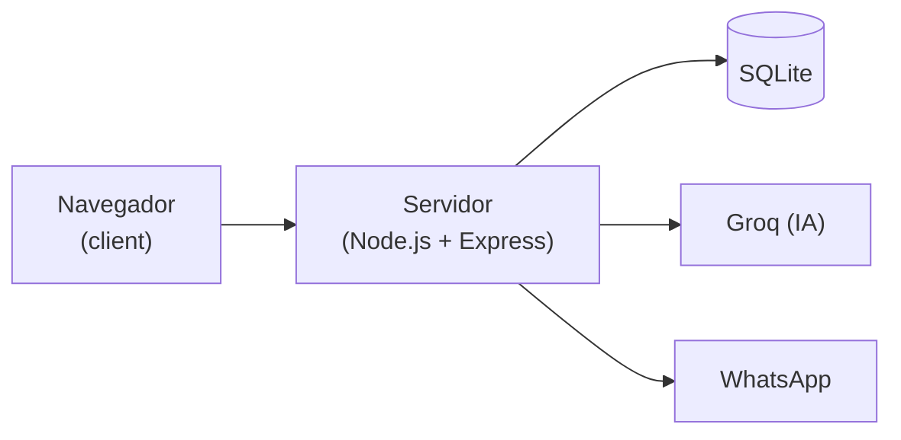
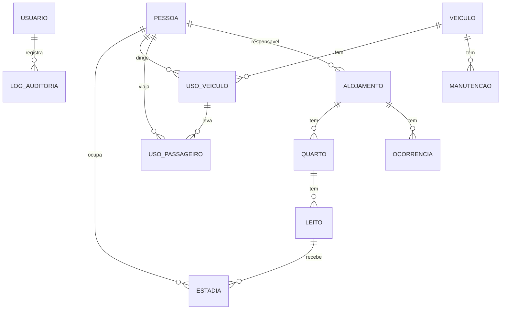

# Planejamento - Dispatch

Grupo DevCore: Bruno, Antonio, João, Henrique, Kelvin, Matheus e Vinicius.

Esse documento junta tudo que a gente decidiu até agora: o problema, o que o sistema vai fazer, as telas, as regras, o banco, como o código vai ser organizado e como vamos dividir o trabalho.

O tema do trabalho é o texto que o professor passou, "Pessoas, Alojamento e Frota: Gestão operacional e eficiência de ativos", com um problema proposto pela Eficaz Marketing (Marília/SP). A Eficaz só propôs o problema. O cenário e o que vai além do que foi pedido fomos nós que decidimos.

A ideia é fazer um sistema simples, mas bem feito. Se tiver uma forma complicada e uma simples de resolver alguma coisa, a gente vai pela simples.


## 1. O problema

Empresas que têm equipes trabalhando em campo, alojamentos e carros da empresa geralmente não sabem direito quem está onde e quem está usando o quê. O controle é feito em planilha ou "de cabeça" (o famoso "alguém sabe onde está quem"), sem histórico e sem registro de quem mudou o quê.

Isso causa vários problemas:

- **Segurança e responsabilidade:** não dá pra provar quem estava com um carro ou em qual alojamento uma pessoa estava.
- **Custo:** carro parado sem uso, viagem desnecessária, retrabalho.
- **Dependência de uma pessoa:** se quem "controla no braço" sai, ninguém sabe mais nada.
- **Conflitos:** briga por leito e por carro.
- **Falta de números:** o gestor não tem relatório confiável pra tomar decisão.

Na pesquisa a gente achou dois exemplos que mostram que isso custa dinheiro de verdade:

- **Multa NIC (Não Indicação do Condutor):** quando um carro da empresa leva multa, a empresa tem de 15 a 30 dias pra dizer quem estava dirigindo. Se não disser, leva outra multa de 2 vezes o valor da original.
- **NR-24:** é a norma que diz como tem que ser o alojamento de trabalhadores. No máximo 8 pessoas por quarto, 3 m² por cama (4,5 m² por beliche), e ela pode ser fiscalizada a qualquer momento.


## 2. Cenário que a gente escolheu

Uma construtora inventada, a **Construtora Aguapeí**, com obras no interior de SP. Os funcionários ficam em repúblicas pagas pela empresa e usam carros e vans que são divididos entre as obras.

Pra testar e apresentar, o banco vai ter uns 15 colaboradores, 3 alojamentos (uns 22 leitos), 6 veículos e 6 meses de histórico inventado, criados por um script (`seed.js`). Sem histórico os relatórios ficariam vazios.

Quem usa o sistema tem um de dois perfis:

- **admin:** vê e faz tudo, incluindo a auditoria e as configurações;
- **operador:** faz os cadastros e registros do dia a dia.


## 3. O que o sistema faz

1. **Cadastros:** colaboradores (com CNH), alojamentos (com quartos, leitos e um responsável) e veículos (com validade do licenciamento e do seguro).
2. **Alojamento:** registra quem está em qual leito e de quando até quando, sem deixar passar da capacidade. Também registra ocorrências (chuveiro quebrado, briga, reclamação...).
3. **Frota:** registra a saída e a volta do veículo (motorista, passageiros, destino e km) e as manutenções. O sistema não deixa sair com CNH vencida, com licenciamento vencido ou com o carro na oficina.
4. **"Quem estava dirigindo?":** escolhe o carro e o dia/hora e o sistema mostra o motorista. Resolve o problema da multa NIC.
5. **Relatórios:** ocupação dos alojamentos, uso de cada veículo, movimentação (quem trocou de alojamento, viagens por destino) e gargalos (horários em que todos os carros estão na rua, alojamentos sempre cheios).
6. **Auditoria:** toda alteração fica registrada (quem fez, quando, como era antes e como ficou).
7. **IA (Groq):** responder perguntas sobre os dados, escrever um resumo dos relatórios, ajudar a usar o sistema e escrever as notificações.
8. **Notificações:** avisos no sistema (CNH vencendo, carro que não voltou...) e os mais importantes também por WhatsApp.

Os itens 7 e 8 são extras que o grupo quis colocar. O sistema tem que funcionar sem eles.

### O que o professor pediu x onde o sistema atende

A gente pegou cada ponto do texto do professor e ligou com uma parte do sistema. Essa tabela vai ser o slide principal da apresentação.

| O que o texto pede | Onde o sistema atende |
|---|---|
| Sistema web | Front em HTML/CSS/JS e back em Node.js |
| Gerenciar colaboradores, alojamento e frota, relacionando cada um | Cadastros + estadia (pessoa no leito) + uso do veículo (pessoa no carro) |
| Relatórios dessas relações | Tela de relatórios |
| Logs para auditoria | Log de toda alteração, com proteção contra edição por fora |
| "Alguém sabe onde está quem" | Histórico da pessoa: onde dormiu e o que dirigiu em qualquer data |
| Alojamento: capacidade | Controle por leito + limite da NR-24 |
| Alojamento: responsáveis | Campo responsável no alojamento |
| Alojamento: histórico de ocupação | Estadias com entrada e saída (nada é apagado) |
| Alojamento: regras e ocorrências | Registro de ocorrências |
| Frota: motorista, passageiros, disponibilidade | Registro de saída/volta; não deixa usar o mesmo carro 2x ao mesmo tempo |
| Frota: documentação | Validade do licenciamento e do seguro |
| Frota: manutenção e status | Registro de manutenção; status disponível / em uso / manutenção |
| Frota: quilometragem | Km de saída e volta; aviso se aparecer km sem registro |
| Relatório de ocupação por alojamento | % de ocupação dos leitos |
| Relatório de uso por veículo | Uso, tempo parado e km de cada carro |
| Padrões de movimentação e gargalos | Relatórios de movimentação e de gargalos |

### Ordem de prioridade

1. **Primeiro, o que o professor pediu:** cadastros, estadias, uso de veículo, ocorrências, manutenções, relatórios, auditoria e login. Isso tem que estar pronto antes de qualquer outra coisa.
2. **Junto, os extras fáceis:** regras de CNH e NR-24, aviso de km sem registro, "quem estava dirigindo" e a proteção do log. Cada um é uma função pequena.
3. **Por último, os extras maiores:** IA, notificações e WhatsApp.

Não vamos fazer: GPS, controle de combustível e custos, checklist de vistoria e reserva de veículo com antecedência.


## 4. Telas

- Figma: https://www.figma.com/design/4ma1oH2S8GnmS6A7NNQTqk/Telas---Dispatch
- Protótipo navegável (HTML com dados de exemplo): pedir acesso pro Antonio

| Tela | O que tem |
|---|---|
| Login | Usuário e senha (**já feita**, em `client/index.html`) |
| Resumo | Números gerais, avisos, últimas movimentações e gráficos de ocupação e uso da frota |
| Colaboradores | Lista com busca; clicando abre o histórico da pessoa; formulário de cadastro |
| Alojamentos | Ocupação, mapa de leitos pra alocar/liberar, aba de ocorrências, cadastro com responsável, quartos e leitos |
| Frota | Lista de veículos com status, saída e volta, aba de manutenções, cadastro com licenciamento e seguro |
| Relatórios e Auditoria | Relatórios (ocupação, uso, movimentação, gargalos, quem estava dirigindo, pergunta pra IA) e o log de alterações |

Ainda falta colocar no Figma: aba de ocorrências, campo de responsável, cadastro de veículo com documentação, aba de manutenções, relatórios de movimentação e gargalos, sininho de notificações e o chat de ajuda.

Visual: tema escuro, azul-marinho, conteúdo em cartões, títulos em maiúsculo, etiquetas coloridas de status (verde = ok, azul = em uso, amarelo = atenção, vermelho = problema) e botão verde pra ação principal.


## 5. Regras

Essas são as validações que o back-end faz antes de salvar. O front pode avisar antes também, mas quem decide é o back. Todas já funcionam no protótipo, então dá pra conferir lá como tem que ficar.

**Alojamento**

- A1. Um leito não pode ter duas pessoas no mesmo período.
- A2. Uma pessoa não pode estar em dois leitos ao mesmo tempo.
- A3. A saída tem que ser depois da entrada (o próprio banco já bloqueia).
- A4. No máximo 8 leitos por quarto (NR-24).
- A5. A área do quarto tem que caber os leitos: 3 m² por cama, 4,5 m² por beliche (NR-24).
- A6. O responsável pelo alojamento tem que ser um colaborador ativo.
- A7. A data de resolução da ocorrência tem que ser depois da abertura (o banco já bloqueia).

**Frota**

- F1. O mesmo carro não pode ter dois usos no mesmo horário.
- F2. Uma pessoa não pode estar em dois carros ao mesmo tempo.
- F3. O motorista precisa ter CNH cadastrada.
- F4. A CNH tem que estar válida no dia da saída.
- F5. A categoria da CNH tem que servir pro veículo. Quem tem C ou D também dirige B, e quem tem E dirige tudo, mas quem só tem B não dirige van de passageiro (D).
- F6. O motorista não pode estar na lista de passageiros.
- F7. Não pode ter mais passageiros que lugares (tirando o motorista).
- F8. A volta tem que ser depois da saída (o banco já bloqueia).
- F9. O km da volta não pode ser menor que o da saída (o banco já bloqueia).
- F10. O km da saída tem que bater com o km da última volta do mesmo carro. Se for maior, alguém usou o carro sem registrar. Isso não bloqueia, só gera um aviso.
- F11. Uso com mais de 2.000 km pede pra confirmar (pode ser erro de digitação).
- F12. Licenciamento vencido não deixa o carro sair. Seguro vencido só gera aviso.
- F13. Carro com manutenção em aberto não pode sair.

**Auditoria**

- U1. Toda criação ou alteração gera uma linha no log com quem fez, quando, como estava antes e como ficou.
- U2. Nada é apagado de verdade, só marcado como inativo.
- U3. Cada linha do log guarda um código (hash) calculado a partir da linha anterior. Se alguém mexer no banco por fora do sistema, os códigos param de bater e a tela de auditoria mostra onde foi.

**Quem estava dirigindo:** procura o uso daquele carro em que a data/hora escolhida fica entre a saída e a volta. Se não achar nada, mas o km tiver aumentado nesse período, avisa que o carro foi usado sem registro.


## 6. Tecnologias

- **Front (`client/`):** HTML, CSS e JavaScript puro, uma página pra cada tela. Os gráficos com Chart.js.
- **Back (`server/`):** Node.js com Express.
- **Banco:** SQLite (ver seção 7).
- **Login:** senha salva com `bcrypt` (nunca a senha pura) e sessão com `express-session`.
- **IA:** Groq, que tem chave grátis.
- **WhatsApp:** WhatsApp Cloud API da Meta, que é oficial e tem número de teste grátis.

O front nunca fala direto com a Groq nem com o WhatsApp, quem faz isso é o back. Assim as chaves ficam só no back, no arquivo `.env`, que não vai pro git.




## 7. Banco de dados

Vamos usar **SQLite** com o pacote `better-sqlite3`, escrevendo o SQL na mão, igual a gente vê na aula. O banco é só um arquivo, então ninguém precisa instalar nada.

As tabelas estão em [server/src/db/schema.sql](../server/src/db/schema.sql), e o banco é criado com `npm run criar-banco` (dentro da pasta `server`). Cada um do grupo tem o próprio banco no seu computador. Pra todo mundo ter os mesmos dados de teste tem o `seed.js` (ainda a fazer).

O banco fica numa pasta fora do projeto (`C:\Users\<seu usuário>\dispatch-dados\`), porque o projeto está no OneDrive e ele pode estragar o arquivo do banco enquanto sincroniza.

Algumas decisões:

- Estadia, uso de veículo e manutenção têm um início e um fim. Fim vazio quer dizer que ainda está acontecendo (a pessoa ainda está no leito, o carro ainda não voltou).
- A ocupação é contada por **leito**, não por quarto.
- Nada é apagado, só marcado como inativo (`ativo = 0`).
- O status do veículo não é salvo numa coluna: ele é calculado. Se tem manutenção aberta está "em manutenção", se tem uso sem volta está "em uso", senão está "disponível". Assim ele nunca fica errado.



As tabelas são: `usuario`, `pessoa`, `alojamento`, `quarto`, `leito`, `estadia`, `ocorrencia`, `veiculo`, `uso_veiculo`, `uso_passageiro`, `manutencao`, `log_auditoria` e `notificacao`.

Pra saber se um leito (ou carro) já está ocupado num período, a consulta é essa (é só trocar a tabela e a coluna pros outros casos):

```sql
SELECT 1 FROM estadia
WHERE leito_id = ?
  AND ? < COALESCE(fim, '9999-12-31')   -- o novo começa antes do existente terminar
  AND inicio < COALESCE(?, '9999-12-31') -- e o existente começa antes do novo terminar
LIMIT 1;
```

### Relatórios

- **Ocupação do alojamento:** leitos ocupados ÷ leitos totais, por dia.
- **Uso da frota:** horas que o carro ficou fora ÷ horas disponíveis. O resto é o tempo parado.
- **Km por veículo:** soma de (km da volta − km da saída).
- **Movimentação:** quem trocou de alojamento, entradas e saídas por semana, viagens por destino.
- **Gargalos:** um mapa de calor com dia da semana × hora mostrando quantos carros estavam na rua, alojamentos acima de 90% de ocupação, carros muito tempo na oficina e ocorrências abertas há muito tempo.

Os números são sempre calculados com SQL. A IA só escreve o texto em cima deles.


## 8. IA (Groq)

A chave é grátis (https://console.groq.com/keys) e fica no `.env` do server.

A IA vai ser usada em 4 lugares:

- **Perguntas:** a pessoa digita algo tipo "quantas pessoas estão no alojamento Centro?". A gente vai ter umas 8 consultas SQL prontas (ocupação de um alojamento, quem estava dirigindo, CNHs vencendo, km por veículo...), e a IA só escolhe qual consulta usar e com quais valores. Ela nunca escreve SQL sozinha, então não tem risco de apagar ou estragar nada.
- **Resumo dos relatórios:** o server calcula os números e pede pra IA escrever um parágrafo explicando.
- **Ajuda:** um chat que responde dúvidas de como usar o sistema, com base num manualzinho que a gente vai escrever.
- **Notificações:** a IA escreve a mensagem do aviso de um jeito mais claro.

Cuidados: o plano grátis tem limite de uso por minuto, então se der erro mostra uma mensagem tipo "tente de novo em alguns segundos". E se não tiver chave configurada, os botões de IA ficam desligados e o resto funciona normal.


## 9. Notificações e WhatsApp

Os avisos são verificados quando o server liga e toda vez que alguém abre a tela de Resumo:

- CNH, licenciamento ou seguro vencendo nos próximos 30 dias;
- km sem registro (regra F10);
- carro que saiu e não voltou depois de X horas;
- alojamento lotado;
- ocorrência aberta há mais de 7 dias;
- carro na oficina há mais de 7 dias;
- log de auditoria adulterado.

Todos aparecem no sininho. Os mais graves (km sem registro, carro que não voltou, CNH vencida com o carro na rua e log adulterado) também vão por WhatsApp pro admin.

Pro WhatsApp vamos usar a **WhatsApp Cloud API** da Meta, que é a oficial e tem um número de teste grátis. Enquanto ninguém configurar isso, a mensagem só aparece no terminal do server. Assim todo mundo consegue testar sem precisar de conta.


## 10. Organização do repositório

```
dispatch/
├── client/                 # front-end (HTML, CSS e JS)
│   ├── index.html          # login (já feito)
│   ├── resumo.html
│   ├── colaboradores.html
│   ├── alojamentos.html
│   ├── frota.html
│   ├── relatorios.html
│   ├── css/                # base.css (cores e botões) + um css por tela
│   └── js/                 # api.js (chamadas pro server), menu.js + um js por tela
│
├── server/                 # back-end (Node.js)
│   ├── src/
│   │   ├── server.js       # liga o servidor e entrega a pasta client
│   │   ├── routes/         # uma rota por assunto: pessoas.js, alojamentos.js, frota.js, relatorios.js...
│   │   ├── regras/         # as validações da seção 5: cnh.js, nr24.js, disponibilidade.js, auditoria.js
│   │   ├── db/             # schema.sql, criar-banco.js (já feitos), conexao.js, seed.js
│   │   ├── ia/             # chamadas pra Groq
│   │   └── whatsapp.js
│   ├── .env.example
│   └── package.json
│
├── docs/planejamento.md    # esse arquivo
└── README.md
```

As regras ficam separadas das rotas pra ficar mais fácil de achar e de testar cada uma.

Pra rodar o projeto precisa do **Node.js 22 ou mais novo**:

```bash
cd server
npm install
npm run criar-banco
```

O próprio server vai entregar as páginas do `client`, então front e back abrem no mesmo endereço (`http://localhost:3001`). Enquanto o server não existe, dá pra abrir o login com a extensão Live Server do VS Code.


## 11. Divisão do trabalho

Cada um pega uma parte e faz o front e o back dela, pra ninguém ficar esperando o outro.

| Parte | O que faz |
|---|---|
| Base do server | Express, conexão com o banco, `seed.js`, login e a função do log de auditoria |
| Base do front | `base.css`, menu lateral, `api.js` e ligar a tela de login no server |
| Colaboradores | Tela, cadastro, histórico da pessoa e regras de CNH |
| Alojamentos | Tela, cadastro, mapa de leitos, estadias, ocorrências e regras A1 a A7 |
| Frota | Tela, cadastro, saída e volta, manutenções e regras F1 a F13 |
| Relatórios e auditoria | Relatórios, gráficos, "quem estava dirigindo" e tela do log |
| IA e notificações | IA, sininho e WhatsApp. Até a base ficar pronta, ajuda no seed e em Alojamentos/Frota |

Alojamentos e Frota são as partes maiores. Se alguém tiver menos tempo, vale colocar duas pessoas nelas.

**Git:**

- Ninguém faz commit direto na `main`. Cada um trabalha na sua branch (ex.: `frota-saida-volta`) e abre um pull request.
- Outra pessoa do grupo dá uma olhada antes de juntar na `main`.
- Commits pequenos e em português (ex.: `valida cnh vencida na saida`).
- Se mudar o `schema.sql`, avisa no grupo, porque todo mundo vai ter que apagar o banco e rodar o `criar-banco` de novo.

**Testes:** antes de abrir o pull request, testar na mão os casos da regra que você fez (um que passa e um que bloqueia) e comparar com o protótipo.


## 12. Cronograma

| Semana | O que entregar |
|---|---|
| 0 | Apresentação (telas do Figma + solução) |
| 1 | Base do server e do front, login funcionando, banco com dados de exemplo |
| 2 | Cadastros (colaboradores, alojamentos, veículos) com log de auditoria |
| 3 | Estadias, ocorrências, saída/volta de veículo, manutenções e as regras |
| 4 | Relatórios, "quem estava dirigindo" e tela de auditoria. **Aqui tudo que o professor pediu tem que estar pronto** |
| 5 | IA e notificações |
| 6 | WhatsApp, ajustes visuais e ensaio da apresentação |

Se o prazo apertar, corta do fim pro começo: primeiro o WhatsApp, depois a IA. As semanas 1 a 4 não podem ser cortadas.


## 13. Roteiro da apresentação

1. Quem somos e quem propôs o problema (Eficaz Marketing).
2. O problema, com os exemplos da multa NIC e da NR-24.
3. O cenário: Construtora Aguapeí.
4. O que o sistema faz.
5. **O que o professor pediu x onde o sistema atende** (tabela da seção 3). É o slide mais importante.
6. As telas do Figma, seguindo o uso real: login, resumo, cadastrar colaborador, colocar num leito, abrir ocorrência, registrar saída de carro, manutenção, relatórios e auditoria.
7. Os extras do grupo: IA e WhatsApp.
8. Como vai ser feito: tecnologias, banco e organização das pastas.
9. Cronograma e divisão do grupo.

Três coisas pra mostrar funcionando no protótipo:

- tentar tirar uma van com um motorista que só tem CNH B, e o sistema bloquear;
- registrar uma saída com km maior que a última volta, e aparecer o aviso de uso sem registro;
- mexer no banco por fora e a auditoria mostrar a linha adulterada.


## 14. LGPD

Os dados são inventados, mas a gente levou em conta:

- os funcionários precisam saber que esses dados são registrados;
- nem todo usuário vê tudo (admin x operador);
- saber onde uma pessoa dormiu é informação sensível, então só quem precisa deve ver;
- pra IA e pro WhatsApp vai só o mínimo necessário (a IA recebe números, não nomes).


## 15. O que ainda falta decidir

- [ ] Confirmar com o professor se SQLite serve ou se ele quer MySQL/PostgreSQL.
- [ ] Prazo final e o que tem que ser entregue.
- [ ] Quem fica com cada parte (seção 11).
- [ ] No relatório de uso da frota, contar o dia todo (24 h) ou só o horário comercial?
- [ ] Atualizar o Figma com o que falta (seção 4).
- [ ] Publicar na internet ou só rodar no computador na apresentação.


## 16. Fontes

- [NR-24 (Guia Trabalhista)](https://www.guiatrabalhista.com.br/legislacao/nr/nr24.htm)
- [NR-24: capacidade e metragem](https://www.asapcontabilidade.com.br/nr-24-alojamentos-capacidade-maxima-metragem-regras-especificas-condicoes-de-uso-areas-minimas/)
- [Camas e beliches na NR-24](https://conexaotrabalho.portaldaindustria.com.br/publicacoes/detalhe/seguranca-e-saude-do-trabalho/normas-regulamentadoras-nr/novas-exigencias-para-camas-e-beliches-na-nr-24/)
- [Multa NIC (Detran-GO)](https://goias.gov.br/detran/1465/)
- [Multa NIC: valor e como evitar](https://www.frota162.com.br/blog/multa-nic-o-que-e/)
- [Categorias da CNH (Exame)](https://exame.com/brasil/guia-do-cidadao/categoria-a-b-c-d-e-quais-veiculos-cada-carteira-de-habilitacao-pode-dirigir/)
- [LGPD nas relações de trabalho](https://www.barbieriadvogados.com/barbieri-advogados-lgpd-nas-relacoes-de-trabalho/)
- [Planilha de controle diário de veículos (Cobli)](https://www.cobli.co/conteudo/planilha-controle-diario-de-veiculos/)
- [Taxa de utilização da frota (Cobli)](https://www.cobli.co/blog/taxa-utilizacao-frota/)
- [better-sqlite3](https://github.com/WiseLibs/better-sqlite3)
- [Groq](https://console.groq.com/docs)
- [WhatsApp Cloud API](https://developers.facebook.com/docs/whatsapp/cloud-api)
