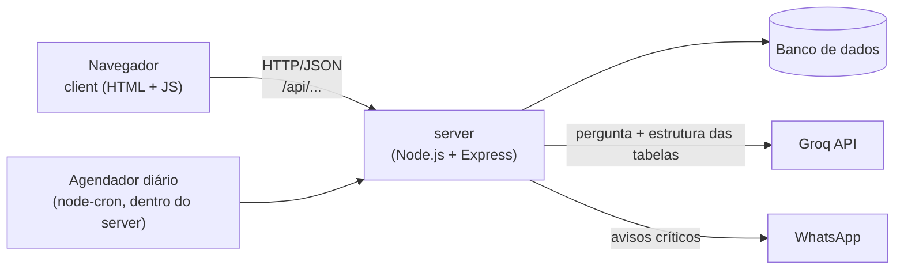
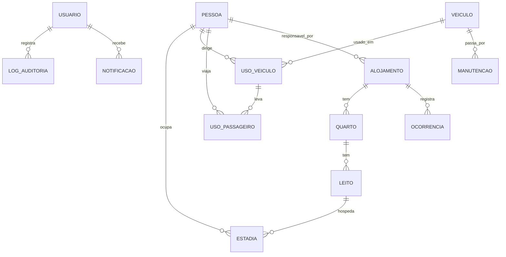

# Planejamento — Dispatch

Documento único de planejamento do Grupo DevCore. Junta a pesquisa, o modelo de dados, as regras de negócio, o guia de contribuição e a proposta de apresentação em um só lugar.

**De onde vem cada parte:**

- **Proposta do professor:** o texto "Pessoas, Alojamento e Frota: Gestão operacional e eficiência de ativos" (seção 1). Pede um sistema web que gerencie colaboradores, alojamento e frota, relacione essas entidades, gere relatórios dessas relações e tenha logs para auditoria. É o **núcleo obrigatório**; a seção 3 mostra, ponto a ponto, onde o sistema atende cada item.
- **Decisões do grupo:** tudo o que vai além disso é diferencial do grupo, e só entra depois do núcleo pronto:

- sistema **web em JavaScript** (Node.js no servidor);
- repositório com **front e back separados** (`client/` e `server/`);
- **IA via Groq** (chave gratuita) para relatórios, perguntas, suporte e notificações;
- **integração com WhatsApp** para enviar avisos quando necessário;
- banco de dados **ainda em decisão** (seção 7 traz a comparação e a recomendação).

Regra geral do projeto: **não precisa ser extremamente trabalhado, mas precisa estar bem feito.** Na dúvida entre uma solução elaborada e uma simples que funciona e está testada, fica a simples.

Grupo DevCore: Bruno, Antonio, João, Henrique, Kelvin, Matheus, Vinicius.
Problema proposto por: Eficaz Marketing (Marília/SP), usado pelo professor como tema do trabalho. É um trabalho de faculdade: a Eficaz só propôs o problema, e o cenário e o que vai além da proposta são decisão do grupo.

---

## Sumário

1. [Problema](#1-problema)
2. [Cenário de uso](#2-cenário-de-uso)
3. [Solução proposta](#3-solução-proposta)
4. [Telas (Figma)](#4-telas-figma)
5. [Regras de negócio](#5-regras-de-negócio)
6. [Arquitetura e stack](#6-arquitetura-e-stack)
7. [Banco de dados](#7-banco-de-dados)
8. [IA com Groq](#8-ia-com-groq)
9. [Notificações e WhatsApp](#9-notificações-e-whatsapp)
10. [Organização do repositório](#10-organização-do-repositório)
11. [Divisão de trabalho e fluxo de git](#11-divisão-de-trabalho-e-fluxo-de-git)
12. [Cronograma](#12-cronograma)
13. [Roteiro da apresentação](#13-roteiro-da-apresentação)
14. [LGPD](#14-lgpd)
15. [Decisões em aberto](#15-decisões-em-aberto)
16. [Fontes](#16-fontes)

---

## 1. Problema

Em operações com equipes em campo, alojamentos e frota, falta **visão integrada sobre quem está onde e quem usa cada ativo** (leito, veículo). O controle costuma ser informal ("alguém sabe onde está quem") ou em planilha, sem histórico nem registro de quem alterou o quê.

Riscos apontados no problema da Eficaz:

| Risco | Exemplo |
|---|---|
| Segurança e responsabilidade | Não conseguir comprovar quem dirigia um veículo ou quem estava em um alojamento |
| Custo | Frota ociosa, deslocamentos desnecessários, retrabalho |
| Continuidade | Dependência de uma pessoa que "controla no braço" |
| Clima e conflitos | Disputa por leito e por veículo |
| Gerencial | Sem indicadores confiáveis para decidir |

Dois exemplos concretos mostram que o problema tem custo real:

- **Multa NIC (Não Indicação do Condutor):** quando um veículo da empresa é multado, ela tem de 15 a 30 dias para informar quem dirigia. Se não informar, recebe uma nova multa de 2 vezes o valor da original. A pergunta "quem dirigia o carro X no dia Y às Z horas?" precisa ter resposta imediata.
- **NR-24 (alojamento de trabalhadores):** fiscalizada por auditores do trabalho. No máximo 8 pessoas por quarto, 3 m² por cama simples ou 4,5 m² por beliche, e nada de 3 camas na mesma vertical.

## 2. Cenário de uso

**Construtora Aguapeí** (fictícia), com obras no interior de SP, equipes alojadas em repúblicas mantidas pela empresa e uma frota compartilhada entre as obras.

Dados de exemplo (os mesmos do protótipo): cerca de 15 colaboradores, 3 alojamentos com cerca de 22 leitos, 6 veículos (carros e vans) e 6 meses de histórico simulado. Os dados são gerados por um script de seed com `@faker-js/faker` em `pt_BR`. Sem histórico, os relatórios e a IA não têm o que mostrar na apresentação.

Perfis de usuário:

| Perfil | Usa principalmente |
|---|---|
| `rh` | Colaboradores, alojamentos |
| `frota` | Frota, saída e retorno de veículos |
| `admin` | Tudo, incluindo auditoria e configuração de avisos |

## 3. Solução proposta

Um **sistema web** que centraliza pessoas, alojamentos e frota, valida as regras antes de gravar e registra toda alteração para auditoria.

O que o sistema faz:

1. **Cadastros:** colaboradores (com CNH), alojamentos (com quartos, leitos e **responsável**) e veículos (com **documentação**: licenciamento e seguro).
2. **Alojamento:** registra quem está em qual leito e por quanto tempo, respeitando a capacidade (e a metragem da NR-24). Registra **ocorrências** (manutenção, conflito, reclamação, regra descumprida) com status aberta/resolvida.
3. **Frota:** registra saída e retorno de veículo (motorista, passageiros, destino, km), validando CNH e a continuidade do km entre usos. Registra **manutenções**; veículo em manutenção fica indisponível. **Status** do veículo (disponível, em uso, manutenção) é calculado a partir desses registros.
4. **Consulta "quem estava dirigindo":** dado um veículo e um horário, mostra o condutor. Resolve a multa NIC.
5. **Relatórios:** ocupação por alojamento, uso por veículo (utilização, ociosidade, km), **padrões de movimentação** (trocas de alojamento, viagens por destino) e **gargalos** (horários com a frota toda em uso, alojamentos sempre cheios, veículos parados em manutenção, ocorrências acumuladas).
6. **Auditoria:** log de toda alteração (quem, quando, antes e depois), com hash encadeado para detectar edição feita por fora do sistema.
7. **IA (Groq):** perguntas em linguagem natural sobre os dados, resumo em texto dos relatórios, chat de suporte de uso do sistema e redação das notificações.
8. **Notificações:** alertas dentro do sistema (CNH ou licenciamento vencendo, km sem registro, veículo não devolvido etc.) e envio por **WhatsApp** dos que forem críticos.

A IA é uma camada **em cima** dos dados, não o núcleo: cadastros, regras e relatórios funcionam sem ela. Se a Groq ficar fora do ar ou estourar o limite gratuito, o sistema continua funcionando.

### Proposta do professor → onde o sistema atende

Cada item citado no texto da proposta tem uma funcionalidade correspondente. Esta tabela é a base do slide principal da apresentação.

| O que a proposta diz | Onde o sistema atende |
|---|---|
| "Sistema web" | Client em HTML/CSS/JavaScript + server Node.js (seção 6) |
| "Gerenciar colaboradores, alojamento e frota, relacionando cada uma dessas entidades" | Cadastros + `estadia` (pessoa ↔ leito) + `uso_veiculo` (pessoa ↔ veículo ↔ passageiros) |
| "Gerando relatórios destas relações" | Tela de Relatórios (seção 7, indicadores) |
| "Com logs para auditoria" | `log_auditoria` com antes/depois, usuário e hash encadeado |
| "Alguém sabe onde está quem" | Histórico da pessoa: onde dormiu e o que dirigiu em qualquer data |
| Alojamento: **capacidade** | Leito como unidade; regras A1, A4, A5 |
| Alojamento: **responsáveis** | `alojamento.responsavel_id` |
| Alojamento: **histórico de ocupação** | Tabela `estadia` (nada é apagado) |
| Alojamento: **regras e ocorrências** | Tabela `ocorrencia`; regras de capacidade e NR-24 |
| Frota: **motorista, passageiros, disponibilidade** | `uso_veiculo` + `uso_passageiro`; regras F1, F2, F6, F7 |
| Frota: **documentação** | Validade de licenciamento e seguro no veículo; regra F12 |
| Frota: **manutenção, status** | Tabela `manutencao`; status calculado; regra F13 |
| Frota: **quilometragem** | km de saída e retorno; regras F9 e F10 |
| Relatório: **ocupação por alojamento** | Indicador de ocupação (noites-leito) |
| Relatório: **uso por veículo** | Utilização, ociosidade e km por veículo |
| Relatório: **padrões de movimentação e gargalos** | Relatório de movimentação e relatório de gargalos |
| Risco de **segurança e responsabilidade** | Auditoria + consulta "quem estava dirigindo" |
| Risco de **custo** / direcionador **eficiência de ativos** | Ociosidade da frota e gargalos |
| Risco de **continuidade** ("controlar no braço") | Tudo registrado no sistema, não na cabeça de alguém |
| Risco de **clima e conflitos** | Bloqueio de dupla alocação de leito e de veículo; ocorrências |
| Risco **gerencial** / direcionador **visão gerencial confiável** | Resumo Operacional e relatórios |

### Prioridades

| Camada | O que entra | Quando |
|---|---|---|
| **1. Núcleo (pedido pelo professor)** | Cadastros com responsável e documentação, estadias, usos de veículo, ocorrências, manutenções, regras de disponibilidade e capacidade (A1–A3, A6, A7, F1–F3, F6–F9, F12, F13), relatórios (ocupação, uso por veículo, movimentação, gargalos), log de auditoria, login | Semanas 1 a 4. **Tem que estar pronto antes de qualquer diferencial** |
| **2. Diferenciais baratos** | Regras de CNH (F4, F5), NR-24 (A4, A5), km sem registro (F10, F11), consulta "quem estava dirigindo", hash encadeado | Junto com o núcleo, quando a tela correspondente já existir |
| **3. Diferenciais do grupo** | IA (Groq), central de notificações, WhatsApp | Semanas 5 e 6, só com o núcleo pronto |

**Fora do escopo:** GPS e telemetria, custos de manutenção e combustível, checklist de vistoria, reserva futura de veículo (ver [decisões em aberto](#15-decisões-em-aberto)).

## 4. Telas (Figma)

**Figma:** https://www.figma.com/design/4ma1oH2S8GnmS6A7NNQTqk/Telas---Dispatch
**Protótipo navegável (HTML, dados fictícios, regras já simuladas):** https://claude.ai/artifact/MNFq4skaifZLm8sqmrGWuJ (link privado; peça acesso a quem publicou)

| Tela | Conteúdo |
|---|---|
| Login | Usuário e senha; o perfil define o que aparece no menu |
| Resumo Operacional | Indicadores (colaboradores, veículos disponíveis, alojamentos, vagas), alertas, movimentações recentes, ocupação e utilização da frota |
| Colaboradores | Busca e tabela (nome, matrícula, cargo, telefone); clique abre o histórico da pessoa |
| Cadastro de Colaborador | Nome, matrícula, cargo, contato, CNH (categorias e validade) |
| Gestão de Alojamentos | Tabela de ocupação (alojamento, colaborador, entrada, saída prevista, status), mapa de leitos para alocar e liberar, e aba **Ocorrências** (abrir, acompanhar e resolver) |
| Cadastro de Alojamento | Nome, **responsável**, CEP, rua, cidade, número, bairro, observações; quartos (área) e leitos (tipo) |
| Gestão de Frota | Tabela de veículos (placa, modelo, km atual, documentação, status) com paginação; registro de saída e retorno; aba **Manutenções** (abrir e encerrar) |
| Cadastro de Veículo | Placa, modelo, lugares, categoria de CNH exigida, km inicial, **validade do licenciamento e do seguro** |
| Relatórios e Auditoria | Aba **Relatórios** (ocupação, uso por veículo, **movimentação**, **gargalos**, "quem estava dirigindo", filtros, exportação, pergunta em linguagem natural, resumo por IA) e aba **Auditoria** (histórico de alterações com verificação de integridade) |

**Telas ou elementos que ainda faltam no Figma.** Os do núcleo vêm primeiro, porque respondem direto à proposta do professor:

- [ ] **Aba Ocorrências** em Gestão de Alojamentos (lista com tipo, data, status; formulário de nova ocorrência).
- [ ] **Campo Responsável** no cadastro de alojamento.
- [ ] **Cadastro de Veículo** com validade de licenciamento e seguro.
- [ ] **Aba Manutenções** em Gestão de Frota.
- [ ] **Relatórios de movimentação e de gargalos** (ver o mapa de calor na seção 7).
- [ ] **Central de notificações:** ícone de sino no cabeçalho com contador e lista de alertas (lido/não lido, severidade).
- [ ] **Chat de suporte (IA):** botão flutuante que abre um painel de conversa.
- [ ] **Configuração de avisos (admin):** quais alertas vão para o WhatsApp e para qual número.
- [ ] **Campo "Resumo por IA"** na aba Relatórios (texto gerado abaixo dos gráficos).

Identidade visual (já definida): cabeçalho e barra lateral em azul-marinho escuro, fundo cinza claro com conteúdo em cartão branco, títulos em caixa alta, pílulas de status coloridas (verde = ativo/ok, azul = em uso, âmbar = atenção, vermelho = crítico, cinza = concluído), botão verde para ação primária e escuro para secundária. Cadastros abrem em tela cheia (cartão centralizado sobre fundo escuro), não em modal pequeno.

## 5. Regras de negócio

Validações que o **server** aplica antes de gravar. O client pode repetir algumas para dar feedback rápido no formulário, mas quem decide é sempre o server. Cada regra já está demonstrada no protótipo e deve virar um teste automatizado.

"Onde validar": **service** significa código no server (precisa consultar outras linhas); **banco** significa que um `CHECK` ou `UNIQUE` na tabela já resolve.

### Alojamento

| # | Regra | Onde | Mensagem sugerida |
|---|---|---|---|
| A1 | Um leito não pode ter duas estadias com período sobreposto | service | "O leito {codigo} estava ocupado por {nome} até {data}. Escolha uma entrada depois disso." |
| A2 | Uma pessoa não pode estar em dois leitos ao mesmo tempo | service | "{nome} já estava no leito {leito} de {inicio} a {fim}." |
| A3 | Saída depois da entrada | banco | "A saída precisa ser depois da entrada ({data})." |
| A4 | No máximo 8 leitos por quarto (NR-24) | service | "{quarto} tem {n} leitos (máximo 8, NR-24)." |
| A5 | Área do quarto comporta os leitos: 3 m² por cama simples, 4,5 m² por beliche (NR-24) | service | "{quarto} tem {area} m², mas a NR-24 exige {exigido} m²." |
| A6 | O responsável pelo alojamento precisa ser um colaborador ativo | service | "{nome} está arquivado e não pode ser responsável por um alojamento." |
| A7 | Ocorrência resolvida precisa de data de resolução posterior à abertura; não se reabre ocorrência resolvida (abre-se outra) | banco (`CHECK`) + service | "A resolução precisa ser depois da abertura ({data})." |

### Frota

| # | Regra | Onde | Mensagem sugerida |
|---|---|---|---|
| F1 | Um veículo não pode ter dois usos sobrepostos | service | "Este veículo já tem um uso registrado nesse horário." |
| F2 | Uma pessoa (motorista ou passageiro) não pode estar em dois usos sobrepostos | service | "{nome} já está no {modelo} {placa} desde {data}." |
| F3 | Motorista precisa ter CNH cadastrada | service | "{nome} não tem CNH cadastrada." |
| F4 | CNH válida **na data da saída** (não na data de hoje) | service | "A CNH de {nome} venceu em {data}." |
| F5 | Categoria da CNH compatível com o veículo | service | "{modelo} exige CNH categoria {cat}. {nome} tem {categorias}." |
| F6 | Motorista não pode estar também na lista de passageiros | service | "O motorista não pode estar também na lista de passageiros." |
| F7 | Passageiros ≤ lugares − 1 | service | "{modelo} tem {lugares} lugares: cabem {n} passageiros além do motorista." |
| F8 | Retorno depois da saída | banco | "O retorno precisa ser depois da saída ({data})." |
| F9 | Km de retorno ≥ km de saída | banco | "O km de retorno não pode ser menor que o de saída ({km})." |
| F10 | Km de saída deve bater com o km de retorno do uso anterior do mesmo veículo; se for maior, houve uso sem registro | service, **alerta** (não bloqueia; gera notificação) | "{modelo} {placa}: {diferença} km sem registro entre {data anterior} e {data atual}." |
| F11 | Uso com mais de 2.000 km pede confirmação | service, alerta | "Mais de 2.000 km num único uso. Confira o valor digitado." |
| F12 | Licenciamento vencido na data da saída bloqueia o uso; seguro vencido gera alerta | service | "O licenciamento do {modelo} {placa} venceu em {data}. Regularize antes de liberar o veículo." |
| F13 | Veículo com manutenção aberta no período não pode ter uso registrado | service | "{modelo} {placa} está em manutenção desde {data}." |

**Categorias de CNH:** A (motos), B (carros), C (carga), D (passageiros, mais de 8 lugares fora o motorista), E (combinações/carretas). Subsunção usada em F5: quem tem C ou D também dirige veículo B; quem tem E dirige tudo. O contrário não vale.

### Auditoria

| # | Regra | Onde |
|---|---|---|
| U1 | Toda criação e alteração em `pessoa`, `alojamento`, `quarto`, `leito`, `estadia`, `ocorrencia`, `veiculo`, `uso_veiculo` e `manutencao` gera uma linha em `log_auditoria` com usuário logado, antes e depois | service, **na mesma transação** da alteração |
| U2 | Nada é apagado de verdade; usa-se a coluna `ativo` | Não existe rota `DELETE` para essas tabelas |
| U3 | Cada linha do log guarda o hash da anterior; a verificação percorre o log e recalcula | Rota `GET /api/auditoria/verificar`, botão na tela de Auditoria |

### Consulta "quem estava dirigindo" (multa NIC)

Dado um veículo e um instante, buscar o uso cujo período `[saida, retorno)` contém o instante (ou `retorno` vazio, se ainda em andamento). Se não houver uso registrado mas houver diferença de km em volta desse instante, avisar que há uma lacuna sem condutor identificado (regra F10).

## 6. Arquitetura e stack



O client **nunca** fala direto com a Groq nem com o WhatsApp. As chaves ficam só no `.env` do server. Esse é um dos motivos concretos para separar front e back.

| Camada | Escolha | Motivo |
|---|---|---|
| Client | **HTML + CSS + JavaScript puro** (uma página por tela, `fetch` para a API) | Decisão do grupo: mais simples de aprender, sem build nem framework |
| Estilo | CSS simples seguindo o Figma, tema escuro | A identidade visual já está definida |
| Gráficos | Chart.js (um `<script>` na página) | Ocupação, utilização da frota e mapa de calor em Relatórios; funciona sem framework |
| Server | **Node.js (LTS) + Express** | Simples, mesmo idioma do front |
| Acesso ao banco | **Knex** (query builder + migrations + seeds) | SQL próximo do real (a IA gera SQL sobre as mesmas tabelas) e troca de SQLite para Postgres mudando só a configuração |
| Autenticação | `bcrypt` (senha) + JWT | Login com perfis; o usuário do token alimenta a auditoria |
| Validação de entrada | `zod` | Valida o corpo das requisições antes de chegar nas regras |
| IA | SDK `groq-sdk` | Chave gratuita |
| Validação do SQL da IA | `node-sql-parser` | Garante que a IA só gera um único `SELECT` |
| WhatsApp | A decidir (seção 9) | Atrás de uma interface, com modo "console" para desenvolvimento |
| Agendamento | `node-cron` | Checagem diária de CNH vencendo, veículos não devolvidos etc. |
| Testes | **Vitest** no server | As regras de negócio ficam no server, então é lá que os testes importam |
| Dados fictícios | `@faker-js/faker` (`pt_BR`) | Seed da Construtora Aguapeí |

### Rotas principais da API

| Método e rota | Faz |
|---|---|
| `POST /api/auth/login` | Login, devolve o token |
| `GET/POST/PUT /api/pessoas` | Colaboradores (sem `DELETE`; arquivar = `ativo: false`) |
| `GET /api/pessoas/:id/historico` | Estadias e usos de veículo da pessoa |
| `GET/POST/PUT /api/alojamentos` (+ quartos e leitos) | Alojamentos |
| `POST /api/estadias`, `PUT /api/estadias/:id/saida` | Alocar e liberar leito |
| `GET/POST /api/ocorrencias`, `PUT /api/ocorrencias/:id/resolver` | Ocorrências do alojamento |
| `GET/POST/PUT /api/veiculos` | Frota |
| `POST /api/usos`, `PUT /api/usos/:id/retorno` | Saída e retorno de veículo |
| `GET/POST /api/manutencoes`, `PUT /api/manutencoes/:id/encerrar` | Manutenções |
| `GET /api/relatorios/ocupacao`, `/frota`, `/movimentacao`, `/gargalos`, `/quem-dirigia` | Relatórios |
| `GET /api/auditoria`, `GET /api/auditoria/verificar` | Log e verificação do hash |
| `POST /api/ia/pergunta`, `/ia/resumo`, `/ia/suporte` | IA |
| `GET /api/notificacoes`, `PUT /api/notificacoes/:id/lida` | Central de notificações |

## 7. Banco de dados

### Opções

| | **SQLite** (via Knex + `better-sqlite3`) | **PostgreSQL** (via Knex + `pg`) | MongoDB |
|---|---|---|---|
| Instalação | Nenhuma; é um arquivo | Instalar local, Docker ou serviço grátis (Neon, Supabase) | Instalar ou Atlas grátis |
| Cada integrante roda sozinho | Sim, cada um gera o próprio arquivo com o seed | Precisa de instância local ou banco compartilhado | Igual ao Postgres |
| Vários usuários ao mesmo tempo | Suficiente para a demonstração | Sim, é o padrão para web | Sim |
| Sobreposição de períodos | Checada no código (service) | Pode ter restrição `EXCLUDE` no próprio banco, além do código | Checada no código |
| Encaixa no modelo | Sim (relacional) | Sim (relacional) | Mal: o problema é todo de relacionamentos e períodos |
| Texto para SQL (IA) | Sim | Sim | Não (não é SQL) |

### Recomendação

**Começar com SQLite e deixar a porta aberta para PostgreSQL**, usando Knex. As migrations e os seeds são os mesmos; trocar de banco é mudar o `client` no `knexfile.js` e a string de conexão no `.env`. Isso deixa os 7 integrantes desenvolvendo sem configurar nada, e se o professor exigir banco "de verdade" ou deploy, a troca não obriga a refazer nada.

MongoDB está descartado: o domínio é relacional (pessoa ↔ leito ↔ período, veículo ↔ motorista ↔ passageiros) e a IA de perguntas depende de SQL.

Cuidado: **não deixar o arquivo do banco dentro de pasta sincronizada do OneDrive**. A sincronização pode corromper um SQLite aberto. Colocar o `.db` fora da pasta (caminho configurável no `.env`) ou pausar a sincronização.

### Modelo de dados

Princípios:

- **Tudo é um período de tempo.** Estadia = pessoa + leito + início + fim. Uso de veículo = veículo + motorista (+ passageiros) + saída + retorno + km. Ocupação, ociosidade e "onde estava fulano no dia X" saem das mesmas consultas.
- **Leito é a unidade**, não o quarto. Sem capacidade por leito não dá para calcular % de ocupação.
- **Período com início incluído e fim excluído.** Uma estadia que termina no dia 10 não conflita com outra que começa no dia 10. Fim vazio (`NULL`) = em andamento.
- **Dois relógios:** quando aconteceu (fica em `estadia`/`uso_veiculo`) e quando foi registrado (fica em `log_auditoria`).
- **Nada é apagado:** coluna `ativo`.
- Datas em ISO 8601, IDs em texto (UUID gerado com `crypto.randomUUID()`).



| Tabela | Campos principais | Restrições |
|---|---|---|
| `usuario` | id, nome, login, senha_hash, perfil, telefone, ativo | `login` único; `perfil` em (`rh`, `frota`, `admin`) |
| `pessoa` | id, nome, matricula, cargo, obra, telefone, cnh_categorias, cnh_validade, ativo | `matricula` única |
| `alojamento` | id, nome, **responsavel_id**, cidade, cep, rua, numero, bairro, observacoes, ativo | `responsavel_id` → `pessoa` |
| `ocorrencia` | id, alojamento_id, pessoa_id (opcional), tipo, descricao, aberta_em, resolvida_em, solucao | `tipo` em (`manutencao`, `conflito`, `reclamacao`, `regra`, `outro`); `resolvida_em IS NULL OR resolvida_em > aberta_em` |
| `quarto` | id, alojamento_id, nome, area_m2 | `area_m2 > 0` |
| `leito` | id, quarto_id, codigo, tipo | `tipo` em (`cama`, `beliche_baixo`, `beliche_cima`); (`quarto_id`, `codigo`) único |
| `estadia` | id, pessoa_id, leito_id, inicio, fim | `fim IS NULL OR fim > inicio`; índices por pessoa e por leito |
| `veiculo` | id, placa, modelo, lugares, categoria_cnh_exigida, km_base, **licenciamento_validade**, **seguro_validade**, ativo | `placa` única; `lugares > 0` |
| `manutencao` | id, veiculo_id, tipo, descricao, inicio, fim, km | `tipo` em (`preventiva`, `corretiva`); `fim IS NULL OR fim > inicio` |
| `uso_veiculo` | id, veiculo_id, motorista_id, destino, saida, retorno, km_saida, km_retorno | `retorno > saida`; `km_retorno >= km_saida`; índices por veículo e motorista |
| `uso_passageiro` | uso_veiculo_id, pessoa_id | chave composta |
| `log_auditoria` | id, quando, usuario_id, acao, tabela, registro_id, resumo, antes_json, depois_json, hash_anterior, hash | só recebe `INSERT` |
| `notificacao` | id, tipo, severidade, mensagem, entidade, entidade_id, criada_em, lida, enviada_whatsapp | **nova** (seção 9) |

**Status do veículo não é gravado, é calculado.** Com manutenção aberta (`fim` vazio) → "manutenção"; com uso em andamento → "em uso"; senão → "disponível". Documentação vencida aparece como pílula âmbar/vermelha ao lado. Guardar o status numa coluna criaria o risco de ele ficar diferente do que os registros dizem.

Consulta de sobreposição (a mesma serve para leito, pessoa, veículo, motorista e manutenção, trocando a tabela e a coluna):

```sql
SELECT 1 FROM estadia
WHERE leito_id = :leito_id
  AND id != COALESCE(:id_atual, '')
  AND :inicio < COALESCE(fim, '9999-12-31 23:59:59')
  AND inicio  < COALESCE(:fim, '9999-12-31 23:59:59')
LIMIT 1;
```

### Auditoria no server

A versão anterior (Python) usava triggers no SQLite. Com um server Node.js fica mais simples fazer no código: o usuário logado já vem do token (`req.usuario`), e a gravação do log acontece **na mesma transação** da alteração. Se uma falhar, as duas voltam atrás.

```js
// server/src/services/auditoria.service.js (esboço)
import { createHash, randomUUID } from 'node:crypto';

export async function registrar(trx, { usuarioId, acao, tabela, registroId, resumo, antes, depois }) {
  const ultima = await trx('log_auditoria').orderBy('quando', 'desc').first('hash');
  const hashAnterior = ultima?.hash ?? 'inicio';
  const linha = {
    id: randomUUID(),
    quando: new Date().toISOString(),
    usuario_id: usuarioId, acao, tabela, registro_id: registroId, resumo,
    antes_json: antes ? JSON.stringify(antes) : null,
    depois_json: depois ? JSON.stringify(depois) : null,
    hash_anterior: hashAnterior,
  };
  linha.hash = createHash('sha256').update(JSON.stringify(linha)).digest('hex');
  await trx('log_auditoria').insert(linha);
}
```

A verificação (U3) percorre o log em ordem, recalcula cada hash e aponta a primeira linha que não bate. Isso não impede que alguém edite o banco por fora, mas deixa a edição **detectável**, e é uma boa demonstração na apresentação.

### Indicadores dos relatórios

**Ocupação por alojamento e uso por veículo**

| Indicador | Fórmula |
|---|---|
| Ocupação do alojamento | noites-leito ocupadas ÷ noites-leito disponíveis × 100 |
| Utilização da frota | horas em uso ÷ horas disponíveis × 100 (horas em manutenção não contam como disponíveis) |
| Ociosidade da frota | 100 − utilização |
| Km por veículo | soma de (km_retorno − km_saida) |
| Usos por veículo | quantidade de registros em `uso_veiculo` no período |

**Padrões de movimentação** (quem se desloca, para onde e com que frequência)

| Indicador | Como sai do banco |
|---|---|
| Trocas de alojamento | Estadias de uma mesma pessoa em alojamentos diferentes dentro do período. Lista quem mais trocou |
| Entradas e saídas por semana | Contagem de `estadia.inicio` e `estadia.fim` por semana, por alojamento |
| Viagens por destino/obra | `uso_veiculo` agrupado por `destino`: quantidade de viagens e km total |
| Motoristas mais frequentes | `uso_veiculo` agrupado por `motorista_id` |

**Gargalos** (onde falta recurso ou onde o problema se acumula)

| Indicador | Como sai do banco | Por que é gargalo |
|---|---|---|
| Mapa de calor da frota | Para cada dia da semana × faixa de hora, média de veículos em uso ÷ frota ativa | Células perto de 100% mostram horários em que ninguém consegue carro |
| Frota esgotada | Intervalos em que todos os veículos ativos estavam em uso ou em manutenção | Momentos concretos de falta de veículo |
| Alojamento saturado | Dias com ocupação ≥ 90%, por alojamento | Onde vai faltar leito na próxima contratação |
| Veículo parado | Dias em manutenção por veículo | Veículo que custa e não roda |
| Ocorrências acumuladas | Ocorrências abertas por alojamento e tempo médio até resolver | Onde a gestão do alojamento está travando |

Os números são sempre calculados por SQL no server. A IA só redige o texto em cima deles (seção 8).

## 8. IA com Groq

Chave gratuita criada em https://console.groq.com/keys, guardada em `GROQ_API_KEY` no `.env` do server. Modelo configurável por variável de ambiente (ex.: `llama-3.3-70b-versatile`; conferir a lista atual de modelos no console da Groq antes de fixar).

A IA atende quatro usos, todos a partir do server:

| Uso | Onde aparece | Como funciona | O que vai para a Groq |
|---|---|---|---|
| **Perguntas** ("quantas pessoas estão no alojamento Centro?") | Aba Relatórios | Texto para SQL: a IA gera a consulta, o server valida e roda | Pergunta + estrutura das tabelas. **Nunca os dados** |
| **Relatórios** (resumo em texto) | Aba Relatórios, abaixo dos gráficos | O server calcula os indicadores por SQL e pede à IA um parágrafo de resumo | Só os números agregados (sem nome de pessoa) |
| **Suporte** ("como registro o retorno de um veículo?") | Chat flutuante | Prompt de sistema com um manual curto de uso (`server/src/ia/manual.md`) | Pergunta + manual. Sem acesso ao banco |
| **Notificações** | Central de notificações e WhatsApp | A partir de um alerta já estruturado, a IA redige uma mensagem curta e clara | Tipo do alerta + dados mínimos |

### Proteções do texto para SQL

1. Enviar só a estrutura das tabelas e a pergunta, nunca os dados.
2. Validar com `node-sql-parser` que a resposta é **um único `SELECT`**, sem `INSERT`, `UPDATE`, `DELETE`, `DROP`, `PRAGMA` nem `ATTACH`.
3. Rodar numa **conexão só de leitura** (`better-sqlite3` com `{ readonly: true }`; no Postgres, um usuário com permissão apenas de `SELECT`).
4. Limitar o resultado (ex.: 200 linhas) e o tempo de execução.
5. Se a consulta der erro, devolver a mensagem à IA para uma segunda tentativa, no máximo uma vez.
6. Mostrar ao usuário o SQL gerado junto com a resposta (transparência, e ajuda a explicar na apresentação).

### Cuidados

- **Limite do plano gratuito:** a Groq limita requisições por minuto e por dia. Tratar o erro 429 com uma mensagem amigável ("A IA está sobrecarregada, tente em alguns segundos") e nunca travar a tela.
- **Tudo funciona sem IA:** se `GROQ_API_KEY` estiver vazia, os botões de IA ficam desativados e as notificações usam um texto fixo.
- **A IA não faz conta nem decide regra.** Números vêm do SQL; validações vêm do service.

## 9. Notificações e WhatsApp

### Quais alertas o sistema gera

| Alerta | Quando | Severidade | Vai para WhatsApp? |
|---|---|---|---|
| CNH vencendo | 30 dias antes do vencimento (checagem diária) | atenção | Não |
| CNH vencida com uso em andamento | Checagem diária | crítico | Sim |
| Km sem registro (F10) | Ao registrar uma saída | crítico | Sim |
| Veículo não devolvido | Uso em andamento há mais de X horas (configurável) | atenção | Sim |
| Alojamento lotado | Ocupação chegou a 100% | atenção | Não |
| Licenciamento ou seguro vencendo | 30 dias antes (checagem diária) | atenção | Não |
| Ocorrência parada | Ocorrência aberta há mais de 7 dias | atenção | Não |
| Manutenção longa | Veículo em manutenção há mais de 7 dias | atenção | Não |
| Falha na verificação de integridade do log | Ao rodar a verificação | crítico | Sim |

Todos os alertas aparecem na **central de notificações** (sino). Só os marcados como "vai para WhatsApp" são enviados, e só se o admin tiver ativado e cadastrado um número.

### Como integrar o WhatsApp

O envio fica atrás de uma interface simples, com dois modos escolhidos no `.env`:

```js
// server/src/notificacoes/whatsapp.js (esboço)
export async function enviarWhatsApp(telefone, texto) {
  if (process.env.WHATSAPP_MODO !== 'api') {
    console.log(`[whatsapp:console] para ${telefone}: ${texto}`);
    return;
  }
  // chamada real ao provedor escolhido
}
```

Assim, ninguém do grupo precisa de conta no provedor para desenvolver; só quem for demonstrar.

Opções de provedor (decisão em aberto):

| Opção | Prós | Contras |
|---|---|---|
| **WhatsApp Cloud API (Meta)** | Oficial e gratuita para teste, com número de teste da própria Meta. A Eficaz é parceira da Meta, o que conversa bem com a apresentação | Precisa de conta de desenvolvedor Meta; mensagens iniciadas pela empresa usam modelos (templates) aprovados; no número de teste só se envia para números cadastrados |
| Twilio (sandbox de WhatsApp) | Configuração rápida, boa documentação | Conta de teste; quem vai receber precisa entrar no sandbox mandando um código |
| `whatsapp-web.js` (não oficial) | Mais fácil de fazer funcionar: lê um QR code e envia | Viola os termos do WhatsApp e o número pode ser bloqueado. Só com chip descartável, e deixar claro que é para demonstração |

**Recomendação:** WhatsApp Cloud API com número de teste. Conferir na documentação da Meta, na hora de implementar, os limites atuais do número de teste e as regras de template.

## 10. Organização do repositório

Front e back separados. O `client/` é HTML, CSS e JavaScript puro, sem `package.json` nem build: cada tela é uma página HTML com seu CSS e seu JS. O `server/` tem o próprio `package.json`, `.env.example` e testes. A raiz só tem documentação e configurações comuns.

```
dispatch/
├── client/                      # front-end (HTML + CSS + JavaScript puro)
│   ├── index.html               # tela de login (já existe)
│   ├── resumo.html
│   ├── colaboradores.html
│   ├── alojamentos.html
│   ├── frota.html
│   ├── relatorios.html
│   ├── css/
│   │   ├── base.css             # cores, fontes, botões, pílulas de status (padrão do Figma)
│   │   ├── login.css            # (já existe)
│   │   └── ...                  # um arquivo por tela
│   └── js/
│       ├── api.js               # todas as chamadas fetch() ao server num lugar só
│       ├── menu.js              # monta a barra lateral e o cabeçalho em todas as páginas
│       ├── login.js             # (já existe)
│       └── ...                  # um arquivo por tela
│
├── server/                      # back-end (Node.js + Express)
│   ├── src/
│   │   ├── routes/              # define as rotas e chama o controller
│   │   ├── controllers/         # lê a requisição, chama o service, devolve JSON
│   │   ├── services/            # regras de negócio (seção 5) e auditoria; sem Express aqui
│   │   │   ├── disponibilidade.service.js
│   │   │   ├── cnh.service.js
│   │   │   ├── nr24.service.js
│   │   │   ├── documentacao.service.js
│   │   │   ├── relatorios.service.js
│   │   │   ├── auditoria.service.js
│   │   │   └── ...
│   │   ├── db/
│   │   │   ├── knexfile.js
│   │   │   ├── migrations/
│   │   │   └── seeds/           # dados da Construtora Aguapeí
│   │   ├── ia/                  # cliente Groq, textoParaSql, resumo, suporte, manual.md
│   │   ├── notificacoes/        # geração de alertas, agendador (node-cron), whatsapp
│   │   ├── middlewares/         # autenticação, perfil, tratamento de erro
│   │   ├── app.js               # monta o Express
│   │   └── server.js            # sobe o servidor
│   ├── tests/                   # Vitest: uma suíte por grupo de regras (A, F, U)
│   ├── .env.example
│   └── package.json
│
├── docs/
│   └── planejamento.md          # este documento
├── .gitignore
└── README.md                    # o que é, como rodar client e server
```

Por que `services/` separado de `routes/` e `controllers/`: as regras da seção 5 precisam de teste automatizado, e testar uma função que recebe dados e devolve "ok" ou "erro" é muito mais fácil do que testar uma rota HTTP inteira.

### Variáveis de ambiente do server (`server/.env.example`)

```bash
PORT=3001
DB_CLIENT=better-sqlite3           # ou pg
DB_CAMINHO=../dispatch.db          # fora de pasta sincronizada
# DATABASE_URL=postgres://...      # se usar Postgres
JWT_SEGREDO=troque-isto
GROQ_API_KEY=                      # vazio = IA desativada
GROQ_MODELO=llama-3.3-70b-versatile
WHATSAPP_MODO=console              # console | api
WHATSAPP_TOKEN=
WHATSAPP_NUMERO_ID=
```

### Como rodar

O client não precisa de instalação. Enquanto o server não existe, dá para abrir o `client/index.html` com a extensão **Live Server** do VS Code (ou qualquer servidor estático).

Quando o server existir, ele mesmo entrega a pasta `client/` com `express.static`. Assim front e back ficam no mesmo endereço (`http://localhost:3001`), o `fetch('/api/...')` funciona sem configurar CORS, e as pastas continuam separadas no repositório.

```bash
cd server && npm install && npm run migrate && npm run seed && npm run dev
# abrir http://localhost:3001
```

O `.gitignore` da raiz já ignora `node_modules/`, `.env` e `*.db`.

## 11. Divisão de trabalho e fluxo de git

Sugestão por frente; o grupo distribui os nomes conforme a disponibilidade. Cada frente de tela faz **front e back** da própria funcionalidade, para ninguém ficar esperando outra pessoa terminar a API.

| Frente | Entrega | Depende de |
|---|---|---|
| 1. Base do server | Express, Knex, migrations, seed, login/JWT, middleware de erro, `auditoria.service` | Nada; é a base |
| 2. Base do client | `base.css` (cores e componentes do Figma), `menu.js` (barra lateral e cabeçalho), `api.js`, ligar a tela de Login (já feita) ao server | Nada; em paralelo com a 1 |
| 3. Colaboradores | Telas + rotas + histórico da pessoa + `cnh.service` (F3–F5) | 1, 2 |
| 4. Alojamentos | Telas + responsável + mapa de leitos + estadias + **ocorrências** + regras A1–A7 | 1, 2 |
| 5. Frota | Telas + documentação + saída e retorno + **manutenções** + status calculado + regras F1, F2, F6–F13 | 1, 2, 3 (CNH) |
| 6. Relatórios e Auditoria | Ocupação, uso por veículo, **movimentação**, **gargalos** (mapa de calor), "quem dirigia", tela de log e verificação de hash | 4, 5 |
| 7. IA e notificações | `ia/` (os 4 usos), central de notificações, agendador, WhatsApp. Até o núcleo ficar pronto, ajuda as frentes 4 e 5 e faz o seed com 6 meses de histórico (os relatórios de gargalo dependem dele) | 1, 6 |

Com 7 pessoas, cada frente pode ter um responsável. Se alguém tiver menos tempo, Alojamentos e Frota são as frentes maiores e as que mais se beneficiam de dupla.

### Fluxo de git

- `main` sempre funcionando. Ninguém commita direto nela.
- Uma branch por tarefa: `feat/frota-saida-retorno`, `fix/cnh-validade`, `docs/planejamento`.
- Commits pequenos, em português, dizendo o que mudou (ex.: `valida sobreposicao de estadia`).
- Pull request para `main` com revisão de pelo menos uma pessoa do grupo.
- Mudou migration? Avise no grupo antes de abrir o PR. É o arquivo que mais gera conflito.

### Checklist antes de abrir PR

- [ ] A regra implementada está na tabela da seção 5? Se for nova, adicionar lá.
- [ ] Tem teste para a regra (caso que passa e caso que bloqueia)?
- [ ] A alteração passa pelo `auditoria.service` na mesma transação?
- [ ] Nenhuma chave (Groq, WhatsApp, JWT) no código ou no client?
- [ ] O comportamento bate com o protótipo navegável?

## 12. Cronograma

Semanas contadas a partir da apresentação. O prazo final da faculdade ainda precisa ser confirmado; se for mais curto, corta-se de baixo para cima: primeiro o WhatsApp real (fica o modo console), depois o resumo por IA. **O núcleo (semanas 1 a 4) não é cortado.**

| Semana | Camada | Entrega |
|---|---|---|
| 0 | — | **Apresentação:** telas do Figma + solução proposta (seção 13). Repositório com `client/` e `server/` criados e rodando um "olá" |
| 1 | Núcleo | Bases (frentes 1 e 2): login, layout, migrations, seed. Cada frente começa o próprio cadastro |
| 2 | Núcleo | Cadastros completos (colaboradores, alojamentos com responsável, veículos com documentação) com auditoria |
| 3 | Núcleo | Estadias, ocorrências, uso de veículo e manutenções, com as regras A e F e seus testes |
| 4 | Núcleo | Relatórios (ocupação, uso por veículo, movimentação, gargalos), "quem dirigia", tela de auditoria com verificação de hash. **Aqui a proposta do professor está 100% atendida** |
| 5 | Diferencial | IA (perguntas, resumo, suporte) e central de notificações |
| 6 | Diferencial | WhatsApp, polimento visual, ensaio da demonstração com os dados de exemplo |

## 13. Roteiro da apresentação

Documento para a apresentação da semana que vem: **telas do Figma + solução proposta para o problema.** Estrutura sugerida (serve para os slides e para o documento escrito):

1. **Quem somos e quem propôs o problema:** Grupo DevCore; Eficaz Marketing (Marília/SP, Google Partner Premier, parceira da Meta, sediada no CIEM).
2. **O problema:** falta de visão integrada sobre quem está onde e quem usa cada ativo (seção 1), com os riscos e os dois exemplos concretos: multa NIC e NR-24.
3. **Cenário escolhido:** Construtora Aguapeí (seção 2).
4. **Solução proposta:** o que o sistema faz, em 8 itens (seção 3).
5. **Proposta → solução:** o slide mais importante. A tabela da seção 3 ("Proposta do professor → onde o sistema atende"), mostrando que cada ponto do texto tem uma resposta concreta.
6. **Telas do Figma:** percorrer as telas na ordem do fluxo real (Login → Resumo → cadastrar colaborador → alocar leito → abrir ocorrência → registrar saída de veículo → manutenção → relatórios de movimentação e gargalos → auditoria), apontando em cada uma qual regra ela aplica.
7. **Diferenciais do grupo (IA e WhatsApp):** os 4 usos da IA (seção 8) e a tabela de alertas (seção 9). Apresentar como "além do que foi pedido" e deixar claro que a IA não substitui cadastro nem regra.
8. **Como vai ser construído:** diagrama de arquitetura (seção 6), estrutura `client/` e `server/` (seção 10) e a decisão de banco (seção 7).
9. **Cronograma e divisão do grupo** (seções 11 e 12), mostrando que o núcleo vem antes dos diferenciais.

Três momentos de demonstração que convencem, todos já funcionando no protótipo navegável:

- **CNH bloqueando:** tentar registrar a saída de uma van com um motorista que só tem categoria B. O sistema bloqueia e explica por quê.
- **Km sem registro:** registrar uma saída com km maior que o último retorno. O sistema gera o alerta (e, na versão final, o aviso no WhatsApp).
- **Log adulterado:** alterar um registro "por fora" e rodar a verificação de integridade. O sistema aponta a linha adulterada.

## 14. LGPD

Os dados são fictícios, mas vale mostrar que o grupo pensou nisso:

- a empresa é a controladora dos dados; a base legal é o contrato de trabalho (ou legítimo interesse), não o consentimento;
- os colaboradores precisam ser avisados por escrito sobre o controle;
- perfis de acesso: nem todo usuário vê tudo (`rh`, `frota`, `admin`);
- histórico de "quem esteve onde" é dado de localização de pessoas e merece cuidado;
- definir por quanto tempo os dados ficam guardados;
- **IA e WhatsApp:** mandar para serviços externos só o mínimo necessário. Texto para SQL envia só a estrutura; o resumo envia só números agregados; mensagens de WhatsApp evitam dados pessoais além do nome.

## 15. Decisões em aberto

- [ ] **Banco de dados:** recomendação é SQLite com Knex, pronto para migrar a Postgres (seção 7). Confirmar com o grupo e com o professor.
- [ ] **Provedor de WhatsApp:** recomendação é WhatsApp Cloud API com número de teste (seção 9).
- [ ] Prazo final e entregáveis da faculdade.
- [ ] Divisão das frentes entre os 7 integrantes (seção 11).
- [ ] Definição de "hora disponível" nos indicadores de frota: 24 h por dia ou só horário comercial. Muda bastante o resultado.
- [ ] Reserva futura de veículo entra no escopo ou só o uso real?
- [ ] Hash encadeado no log: em Node é barato de fazer (seção 7). Recomendação: entra.
- [ ] Deploy (ex.: client na Vercel, server no Render) ou só rodar local na apresentação.
- [ ] Atualizar o Figma com os elementos novos (seção 4), começando pelos do núcleo (ocorrências, responsável, documentação, manutenções, movimentação e gargalos).
- [ ] Perguntas por IA: SQL livre gerado pela IA (seção 8) ou um conjunto de consultas prontas que a IA só escolhe e preenche. Consultas prontas são mais seguras para a demonstração.

Já decidido: cenário (Construtora Aguapeí), telas e identidade visual (Figma), linguagem (JavaScript/Node.js), repositório com `client/` e `server/` separados, IA via Groq, integração com WhatsApp, prioridade do núcleo pedido pelo professor sobre os diferenciais.

## 16. Fontes

**Normas e legislação**
- [NR-24 (Guia Trabalhista)](https://www.guiatrabalhista.com.br/legislacao/nr/nr24.htm)
- [NR-24: capacidade e metragem](https://www.asapcontabilidade.com.br/nr-24-alojamentos-capacidade-maxima-metragem-regras-especificas-condicoes-de-uso-areas-minimas/)
- [Camas e beliches na NR-24](https://conexaotrabalho.portaldaindustria.com.br/publicacoes/detalhe/seguranca-e-saude-do-trabalho/normas-regulamentadoras-nr/novas-exigencias-para-camas-e-beliches-na-nr-24/)
- [Alojamento para trabalhadores (Conjur)](https://conjur.com.br/2024-out-23/alojamento-para-trabalhadores-solucao-que-exige-atencao-das-empresas/)
- [Multa NIC (Detran-GO)](https://goias.gov.br/detran/1465/)
- [Multa NIC: valor e como evitar](https://www.frota162.com.br/blog/multa-nic-o-que-e/)
- [Categorias da CNH (Exame)](https://exame.com/brasil/guia-do-cidadao/categoria-a-b-c-d-e-quais-veiculos-cada-carteira-de-habilitacao-pode-dirigir/)
- [LGPD e geolocalização](https://lgpdsolucoes.com.br/blog/lgpd-geolocalizacao/)
- [LGPD nas relações de trabalho](https://www.barbieriadvogados.com/barbieri-advogados-lgpd-nas-relacoes-de-trabalho/)

**Frota e alojamento (referências de produto)**
- [Planilha de controle diário (Cobli)](https://www.cobli.co/conteudo/planilha-controle-diario-de-veiculos/) e [taxa de utilização da frota](https://www.cobli.co/blog/taxa-utilizacao-frota/)
- [Ociosidade da frota](https://golfleet.com.br/ociosidade-da-frota)
- [Contele Fleet](https://contelefleet.com.br/checklist-do-veiculo-online), [DriveList](https://www.drivelist.com.br/), [Frota Control](https://frotacontrol.com.br/conheca-o-sistema/)
- [RMS Workforce](https://www.rmscloud.com/solutions/workforce), [CampLogistiks](https://camplogistiks.com/camp-logistiks/workforce-housing/), [Camps & Crew](https://www.campsandcrew.com/software-for-workforce-camp)

**Modelagem e auditoria**
- [Fowler: Temporal Object](https://martinfowler.com/eaaDev/TemporalObject.html)
- [Fowler: Bitemporal History](https://martinfowler.com/articles/bitemporal-history.html)
- [Log de auditoria em JSON (Simon Willison)](https://til.simonwillison.net/sqlite/json-audit-log)

**Stack**
- [Groq: chaves de API](https://console.groq.com/keys)
- [Text-to-SQL com Groq](https://github.com/smaoui-me/self-correcting-text-to-sql) e [sql-guardrails](https://github.com/darrshangovender/sql-guardrails)
- [Knex](https://knexjs.org/)
- [WhatsApp Cloud API (Meta)](https://developers.facebook.com/docs/whatsapp/cloud-api)
